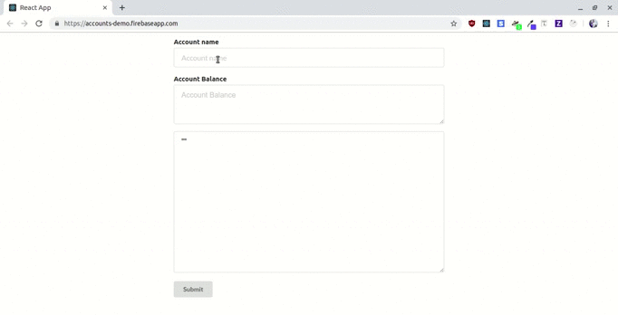

<h1>Table of Contents</h1>

- [Google io2019 Extended Codelab](#google-io2019-extended-codelab)
- [Getting Started](#getting-started)
  - [Step 1](#step-1)
  - [Step 2](#step-2)
  - [Step 3](#step-3)
  - [Step 4](#step-4)
  - [Step 5](#step-5)
  - [Step 6](#step-6)
  - [Step 7](#step-7)
- [Contributing](#contributing)
- [Authors](#authors)
- [License](#license)
- [References](#references)

## Google io2019 Extended Codelab

Code lab on deploying your blockchain application to firebase hosting.

We will be using eosjs-api to fetch and display account data from the blockchain. The user interface library we will be using is semantic-ui-react.

The frontend javascript library we will use is React js.

<p  align="left">
  
</p>

## Getting Started

These instructions will get you a copy of the project up and running on your local machine.

### Step 1

Install the firebase cli. Ensure that you have npm running.

```bash
npm install -g firebase-tools
```

Log in to your firebase account by typing in

```bash
firebase login
```

Quick check to see all your authentication worked

```bash
firebase list
```

### Step 2

Create a new project folder

```bash
mkdir io
```

Initialize a new firebase project

```bash
firebase init
```

During the prompts

- Select hosting
- Use build as your public root library
- Configure as a single page application

Once initialization has been done, go to https://console.firebase.google.com and create a new project. With that you can now associate your folder with the project created on the firebase console.

```bash
firebase use --add
```

### Step 3

Let's create our react application

```bash
create-react-app io
```

And add the following node modules

```bash
yarn add eosjs-api
yarn add semantic-ui-react
yarn add semantic-ui-css
```

and run

```bash
yarn start
```

### Step 4

Let's test to see if our deployment will work. We will run yarn build to build our project.

```bash
yarn build
```

Then run firebase deploy to deploy our default app

```bash
firebase deploy
```

### Step 5

In our index.js we add our styling for semantic ui

```js
import "semantic-ui-css/semantic.min.css";
```

and in our index.css we add

```css
html,
body > div,
body > div > div {
  height: 100vh;
}
```

To ensure our height is 100

### Step 6

Remove App.css since we will not need it

Add the following code to our App.js file to display the accounts component

```js
import React from "react";
import Account from "./container/Account/Account";

function App() {
  return (
    <div className="App">
      <Account />
    </div>
  );
}

export default App;
```

Create a folder for the account component and create an account.js file

```bash
--src
----account
------account.js

```

### Step 7

Render the account component

```js
import React, { Component } from "react";
import { Form, TextArea, Input, Grid, Button } from "semantic-ui-react";
import EosApi from "eosjs-api";

const endpoint = "https://api.eosnewyork.io";

class Account extends Component {
  constructor(props) {
    super(props);
    this.state = {
      account: "",
      info: "",
      balance: ""
    };
    this.onChange = this.onChange.bind(this);
    this.onSubmit = this.onSubmit.bind(this);
  }
  onChange(e) {
    this.setState({ [e.target.name]: e.target.value });
  }
  onSubmit(e) {
    e.preventDefault();
    let account = this.state.account;
    let options = {
      httpEndpoint: endpoint,
      verbose: false
    };
    let eos = EosApi(options);
    eos
      .getAccount(account)
      .then(result =>
        this.setState({ info: result, balance: result.core_liquid_balance })
      );
  }
  render() {
    return (
      <Grid style={{ height: "100vh" }} verticalAlign="middle" centered>
        <Grid.Column style={{ width: "100vh" }}>
          <Form className="Form" size="large">
            <Form.Field
              control={Input}
              label="Account name"
              name="account"
              placeholder="Account name"
              value={this.state.account}
              onChange={this.onChange}
            />
            <Form.Field
              control={TextArea}
              label="Account Balance"
              name="balance"
              placeholder="Account Balance"
              value={this.state.balance}
              onChange={this.onChange}
            />
            <Form.Field
              control={TextArea}
              placeholder="Account information"
              style={{ height: "50vh" }}
              value={JSON.stringify(this.state.info)}
            />
          </Form>
          <br />
          <Button type="submit" onClick={this.onSubmit}>
            Submit
          </Button>
        </Grid.Column>
      </Grid>
    );
  }
}

export default Account;
```

## Contributing

Please read [CONTRIBUTING.md](https://gist.github.com/PurpleBooth/b24679402957c63ec426) for details on our code of conduct, and the process for submitting pull requests to us.

## Authors

**Peter Okwara** https://github.com/peterokwara

## License

This project is licensed under the MIT License - see the [LICENSE.md](LICENSE.md) file for details

## References

- Firebase https://firebase.google.com/
- Getting started with firebase hosting https://firebase.google.com/docs/hosting/quickstart
- Eosjs-api https://github.com/EOSIO/eosjs-api
- Semantic-ui-react https://react.semantic-ui.com/
